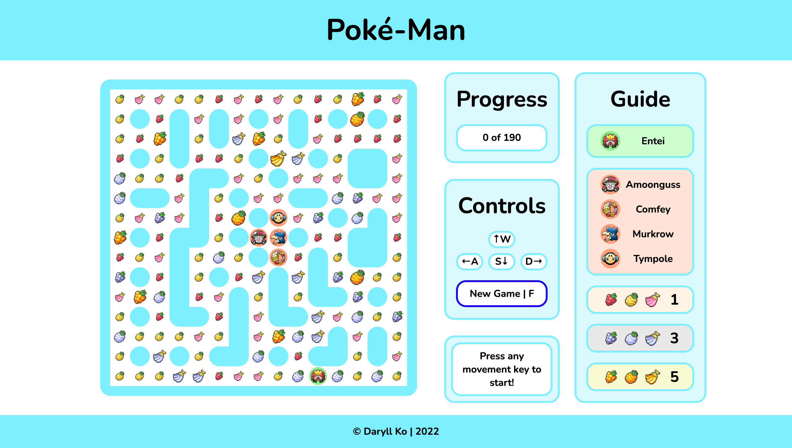

# Poké-Man

  

 

Poké-Man is [Pac-Man](https://en.wikipedia.org/wiki/Pac-Man), but with Pokémon!

This is Version 1 of the game, which I created using plain HTML, CSS, and JavaScript.

I planned on refactoring the code for Version 2 using Sass and TypeScript, but things didn't go as I planned. Managing the various components manually was a pretty inconvenient task, and it made me realize why React and other frameworks exist in the first place.

As a result, I've scrapped the development of Version 2, and I'll be using React to develop Version 3. Hopefully things go smoother this time, but I guess I just have to give it a go. You can find V3's repo [here](https://github.com/daryll-ko/poke-man)!

## Dev Comments

- One of the longest time drains was from not realizing that my `index.js` file should have been at the last section inside my `<body>` tags.

- The maze was generated using randomized depth-first-search. I do have plans on including other [maze generation algorithms](https://en.wikipedia.org/wiki/Maze_generation_algorithm) in V3. I wanted the borders to be accessible, so I generated the inner section first before naively plopping a bunch of bridges between this inner section and the borders.

- I used [Floyd-Warshall's algorithm](https://en.wikipedia.org/wiki/Floyd%E2%80%93Warshall_algorithm) to compute the shortest distance between all pairs of paths in the maze, and I programmed the chasers to use this information for their movements. This makes the game pretty difficult, I must say—I've only beaten it a couple of times.

- It's a small thing, but I really like the progress bar. A few lines of JavaScript can do really neat things with CSS!

## Reflections

This is my first web development project! 😃

I've always wondered when I would come up with one. The whole concept of a project has been really nebulous to me as someone who's never gotten their hands into one (at least, not of this scale).

I wish I'd started earlier (well, that applies to most things). Motivation isn't really my bottleneck when it comes to getting things done: you can check out [my recreational programming repo](https://github.com/daryll-ko/rec-prog) to see that. I think it was more on finding **inspiration** for a project.

I'd say that the vast majority of time I've spent on games was spent on [Pokémon](https://en.wikipedia.org/wiki/Pok%C3%A9mon_(video_game_series)) games. I've played through the main series games and they were great (especially *Legends: Arceus*; what a masterpiece!), but the games in which I had the most fun were the **spin-offs** (Ranger, Conquest, Mystery Dungeon, Shuffle, etc.).

Ah, well. I could ponder on the past for hours on end, but what ultimately matters is where I'm at now, and I'm happy to say that I finally feel like I'm on the side where the grass is greener. :)

## Log

### 1.3 (Feb. 19, 2022)

- Incorporated Floyd-Warshall to make chasers smart (too smart, actually...)
- Made site somewhat responsive
- Minor UI improvements

### 1.2 (Feb. 13, 2022)

- Added more berries
- Upgraded UI

### 1.1 (Feb. 12, 2022)

- Added game lifecycle buttons (reset, pause / continue)
- Incorporated Pokémon!

### 1.0 (Feb. 8, 2022)

- Finished minimum viable product (no Pokémon yet!)
