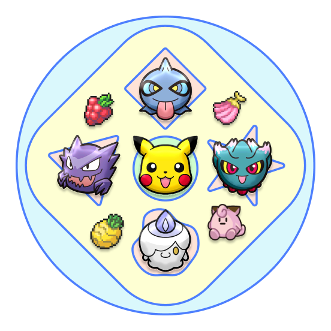

  
  <h2>Poké-Man</h2>
  <i>Pac-Man, but with Pokémon!</i>
   
  v1 • <a href="https://github.com/daryll-ko/poke-man-v2" target="_blank" rel="noopener noreferrer">v2</a>

 

This is the first iteration of Poké-Man, my first major coding project. I only used plain HTML, CSS, and JavaScript for this one.

Despite its primitive nature, I keep it up-to-date with its successor (see v2 link above).

## Stories

- One of the longest time drains was from not realizing that my `index.js` file should have been at the last section inside my `<body>` tags.

- The maze was generated using randomized depth-first-search. I do have plans on including other [maze generation algorithms](https://en.wikipedia.org/wiki/Maze_generation_algorithm) in V3. I wanted the borders to be accessible, so I generated the inner section first before naively plopping a bunch of bridges between this inner section and the borders.

- I used [Floyd-Warshall's algorithm](https://en.wikipedia.org/wiki/Floyd%E2%80%93Warshall_algorithm) to compute the shortest distance between all pairs of paths in the maze, and I programmed the chasers to use this information for their movements. This makes the game pretty difficult, I must say—I've only beaten it a couple of times.

- It's a small thing, but I really like the progress bar. A few lines of JavaScript can do really neat things with CSS!

## Reflections

This is my first web development project! 😃

I've always wondered when I would come up with one. The whole concept of a project has been really nebulous to me as someone who's never gotten their hands into one (at least, not of this scale).

I wish I'd started earlier (well, that applies to most things). Motivation isn't really my bottleneck when it comes to getting things done: you can check out [my recreational programming repo](https://github.com/daryll-ko/rec-prog) to see that. I think it was more on finding **inspiration** for a project.

I'd say that the vast majority of time I've spent on games was spent on [Pokémon](<https://en.wikipedia.org/wiki/Pok%C3%A9mon_(video_game_series)>) games. I've played through the main series games and they were great (especially _Legends: Arceus_; what a masterpiece!), but the games in which I had the most fun were the **spin-offs** (Ranger, Conquest, Mystery Dungeon, Shuffle, etc.).

Ah, well. I could ponder on the past for hours on end, but what ultimately matters is where I'm at now, and I'm happy to say that I finally feel like I'm on the side where the grass is greener. :)
